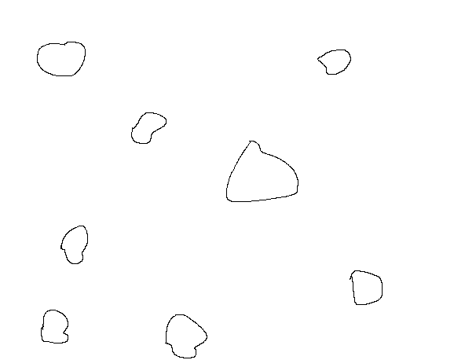

# Structured and unstructured meshing algorithms

### In this repo  you can find implementation of two meshing algorithms:
- QuadTree algorithm (structured mesh)
- Delaunay triangulation using Bowyer-Watson method  (unstructured mesh) 

## Resources
Description and pseudocode of algorithms:
- [Triangulation](https://en.wikipedia.org/wiki/Bowyer%E2%80%93Watson_algorithm) 
- [QuadTree](https://en.wikipedia.org/wiki/Quadtree)

## Demo

An example output of QuadTree algorithm (mesh size parameter is set to 5 for the first image and 25 for the second): 
Before meshing

After meshing

An example output of Bowyer-Watson method. The algorithm generates additional points to improve mesh structure.

Before meshing

After meshing

## TODO
- fix Laplacian smoothing

## Authors
- [@grubci0o](https://github.com/grubci0o)
- [@curaposterior](https://github.comm/curaposterior)

